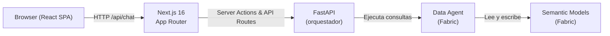
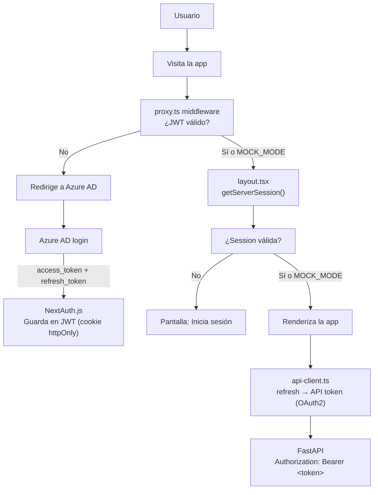
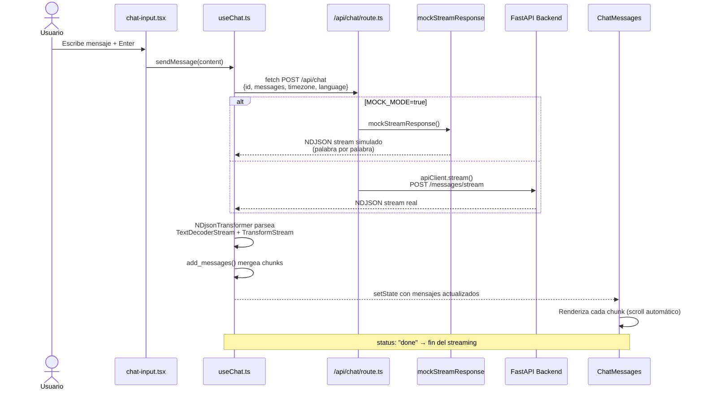
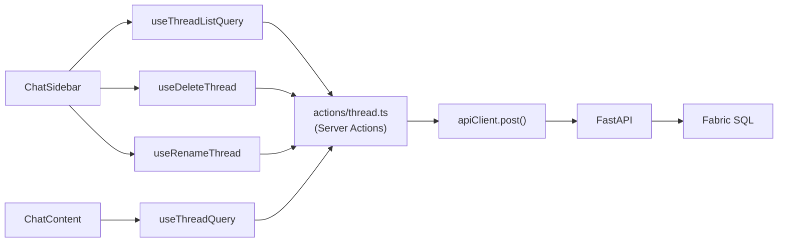
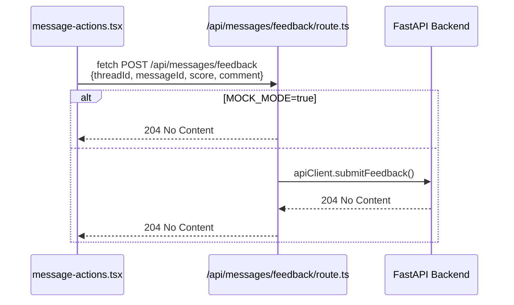
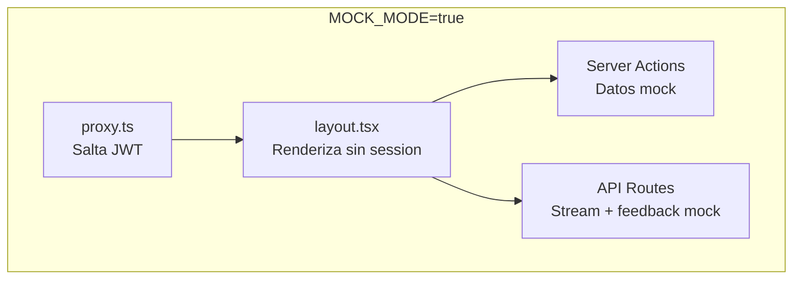

# AI Hub Frontend

## ¿Qué es?

**AI Hub** es una aplicación web frontend construida con **Next.js 16 + React 19 + TypeScript** que sirve como interfaz de chat conversacional con un asistente de IA especializado en la industria del acero. Está orientada a **Ternium** (empresa siderúrgica) y permite consultar información sobre aceros globales, grados, propiedades, usos comerciales, etc.

## Stack principal

| Tecnología | Uso |
|---|---|
| Next.js 16.2.6 (App Router) | Framework full-stack con RSC y API routes |
| React 19.2.4 | UI |
| TypeScript 5.9 | Tipado estricto |
| Tailwind CSS v4 + shadcn/ui (Radix-Nova) | Estilos y componentes |
| TanStack React Query v5 | Estado del servidor, caché y mutaciones |
| NextAuth.js v4 | Autenticación Azure AD (Entra ID) |
| Recharts | Gráficos dinámicos inline (bar, line, area, donut) |
| react-markdown + remark-gfm + rehype-raw | Renderizado Markdown |

---

## Arquitectura



- **Next.js** actúa como proxy: las Server Actions y API Routes se comunican con FastAPI.
- **FastAPI** orquesta el **Data Agent**, que interactúa con los **Semantic Models** de Fabric.
- El frontend **no tiene lógica de permisos** — solo autentica al usuario y pasa el token al backend. La autorización se resuelve del lado de FastAPI + Data Agent.

---

## Estructura del proyecto

```
aihub-front/
├── app/                              # App Router (páginas y API routes)
│   ├── page.tsx                      # Home → nuevo chat con UUID
│   ├── layout.tsx                    # Root layout: auth check + providers
│   ├── globals.css                   # Tailwind v4 + custom animations
│   ├── fonts.ts                      # Fuentes locales Roboto + Roboto Mono
│   ├── [id]/page.tsx                 # Ruta dinámica para un thread existente
│   └── api/
│       ├── auth/[...nextauth]/route.ts  # NextAuth handler
│       ├── chat/route.ts                # POST: proxy streaming a FastAPI
│       └── messages/feedback/route.ts   # POST: feedback de mensajes
│
├── components/
│   ├── auth-provider.tsx             # SessionProvider wrapper (NextAuth client)
│   ├── chat/                         # Core del chat
│   │   ├── chat-content.tsx          # Orquestador: conecta hooks con UI
│   │   ├── chat-header.tsx           # Barra superior con toggle sidebar + nuevo chat
│   │   ├── chat-footer.tsx           # Disclaimer
│   │   ├── chat-input.tsx            # Textarea auto-redimensionable con borde animado
│   │   ├── chat-messages.tsx         # Lista scrollable de mensajes
│   │   ├── chat-sidebar.tsx          # Sidebar izquierdo con lista de threads
│   │   ├── chat-overview.tsx         # Vista inicial (logo + título + subtítulo)
│   │   ├── chat-prompt-cards.tsx     # Tarjetas de sugerencias rápidas
│   │   ├── message.tsx               # Burbuja de mensaje individual
│   │   ├── message-actions.tsx       # Botones: copiar, thumbs up/down
│   │   ├── markdown.tsx              # Renderer Markdown personalizado
│   │   ├── chart-renderer.tsx        # Renderiza gráficos desde bloques ```chart
│   │   ├── hooks/
│   │   │   ├── useChat.ts            # Lógica del chat: send, stream, cancel, reload
│   │   │   ├── useThread.ts          # Fetch de historial de un thread
│   │   │   ├── useThreadList.ts      # Lista de threads + delete/rename mutations
│   │   │   └── useAppInfo.ts         # Fetch de metadatos del chatbot
│   │   └── actions/                  # Server Actions
│   │       ├── thread.ts             # getThreadList, getThread, deleteThread, renameThread
│   │       └── app-info.ts           # getAppInfo
│   └── ui/                           # shadcn/ui primitives
│       ├── button.tsx, input.tsx, sidebar.tsx, sheet.tsx
│       ├── dropdown-menu.tsx, scroll-area.tsx, separator.tsx
│       ├── skeleton.tsx, spinner.tsx, tooltip.tsx
│
├── lib/
│   ├── api-client.ts                 # Cliente HTTP para FastAPI (GET/POST/PUT/DELETE + stream)
│   ├── api-token.ts                  # Intercambio refresh token → access token con cache
│   ├── auth.ts                       # Config NextAuth (Azure AD provider)
│   ├── utils.ts                      # cn(), getClientBasePath()
│   ├── chat-utils.ts                 # NDJSON transformer, merge de mensajes, UUID
│   └── mock-data.ts                  # Datos mock para desarrollo sin backend
│
├── types/
│   ├── thread.ts                     # Tipos: mensajes, threads, sources, tool calls, feedback
│   ├── chart.ts                      # DynamicChartProps
│   ├── app-info.ts                   # AppInfoResponse
│   └── next-auth.d.ts                # Augmentación de Session/JWT
│
├── hooks/
│   └── use-mobile.ts                 # Detección de mobile (< 768px)
│
├── react-query/
│   ├── get-query-client.ts           # Singleton QueryClient
│   └── react-query-provider.tsx      # QueryClientProvider
│
├── public/fonts/                     # Roboto + Roboto Mono (WOFF2)
├── k8s/                              # Manifiestos Kubernetes
│   └── frontend-app-deployment.yaml  # Deployment + Service
│
├── proxy.ts                          # Middleware de autenticación
├── next.config.ts                    # Config Next.js (standalone, base path, source maps)
├── components.json                   # Config shadcn/ui
├── Dockerfile                        # Build multi-stage (node:20-alpine)
├── AGENTS.md                         # Advertencia sobre breaking changes de Next.js 16
└── .env.local                        # Variables de entorno local (MOCK_MODE=true para desarrollo)
```

---

## Flujo de autenticación



**Tipos de sesión** (`types/next-auth.d.ts`):
- `session.accessToken` — token de Azure AD
- `session.refreshToken` — refresh token para renovar
- `session.userId` — ID del usuario (sub / OID)

---

## Flujo del chat (streaming)



### Formato NDJSON (PartialState)

```typescript
interface PartialState {
  messages?: ValidMessage[];      // Chunks parciales o mensaje final
  sources?: SourceDocument[];     // Documentos fuente referenciados
  summaries?: AISummaryMessage[]; // Resúmenes
  status_message?: string;        // Estado textual
  status?: 'streaming' | 'error' | 'done' | 'disconnected';
  title?: string | null;          // Título del thread (auto-generado)
}
```

### Tipos de mensaje

| Tipo | Uso |
|---|---|
| `human` | Mensaje del usuario |
| `AIMessageChunk` | Chunk parcial durante streaming |
| `ai` | Mensaje final del asistente |
| `HumanMessageChunk` | Transcripción de audio del usuario |
| `tool` | Resultado de tool call |
| `system` | Mensaje del sistema |
| `chat` | Mensaje genérico con role |

---

## Flujo de threads (Server Actions)



Los hooks usan TanStack React Query para cachear las respuestas (`staleTime: Infinity`) e invalidar la lista cuando se crea/elimina/renombra un thread.

---

## Feedback de mensajes



El feedback se envía directamente desde el cliente al API route de Next.js, que lo reenvía a FastAPI. No usa Server Actions.

---

## Mock Mode (desarrollo sin backend)

Activado con `MOCK_MODE=true` en `.env.local`. Permite correr el frontend completamente standalone.

### Qué mockea:



### Datos mock (`lib/mock-data.ts`):

```typescript
MOCK_THREAD_LIST: 3 threads ("Aceros con alto contenido de carbono",
                   "Propiedades del acero inoxidable 304",
                   "Comparativa de grados de acero estructural")
MOCK_APP_INFO: { title: "Global Steel Grade",
                 subtitle: "Agente especializado en aceros globales y pesquería" }
```

El mock simula streaming palabra por palabra con delays aleatorios (15-35ms), acumulando el texto en chunks `AIMessageChunk` y finalizando con un mensaje `ai` + `status: "done"`.

---

## Componentes clave

### `useChat` hook (`components/chat/hooks/useChat.ts`)

Es el corazón de la app. Maneja:
- Estado local de mensajes, sources, streaming, errores
- Envío de mensajes (texto o audio)
- Cancelación vía AbortController
- Procesamiento de stream NDJSON con merge de chunks
- Detección de errores de autenticación (dispara evento `fetch-auth-error`)
- `reload()` para re-enviar el último mensaje

### `Markdown` renderer (`components/chat/markdown.tsx`)

- Renderiza Markdown con GFM (tablas, listas, blockquotes, code blocks)
- Soporta bloques ` ```chart ` → `ChartRenderer` (Recharts)
- Reemplaza referencias a fuentes (`[1]`, `[@ref_2]`) con tags `<source-ref>`
- Memoizado para evitar re-renders innecesarios durante streaming

### `ChatSidebar` (`components/chat/chat-sidebar.tsx`)

- Lista de threads con menú contextual (editar nombre, eliminar)
- Input inline para renombrar
- Logo de Ternium en SVG
- Usa `useIsMobile()` para adaptar comportamiento

---

## Estilos

- **Tailwind CSS v4** con `@tailwindcss/postcss`
- **shadcn/ui** con `tw-animate-css` para animaciones
- **Borde animado** en el input: gradiente cónico rotatorio con glow
- **Tema**: variables CSS en `globals.css` para personalización
- **Layout** full-height con flexbox, sidebar colapsable

---

## Despliegue

### Docker

Multi-stage build en `Dockerfile`:
1. `deps` — npm ci (solo production)
2. `build` — next build
3. `runner` — node:20-alpine con output standalone

### Kubernetes

`k8s/frontend-app-deployment.yaml` incluye:
- Deployment con replicas configurables
- Service (puerto 3000)
- Variables de entorno desde `frontend-secret-kv` (Azure Key Vault via Stakater Reloader)
- Elastic APM configurado
- `NEXT_PUBLIC_BASE_PATH` para servir detrás de un ingress con ruta base

### Variables de entorno

| Variable | Descripción |
|---|---|
| `API_BACKEND_URL` | URL del backend FastAPI |
| `AZURE_AD_CLIENT_ID` | Client ID de Azure AD |
| `AZURE_AD_CLIENT_SECRET` | Client Secret |
| `AZURE_AD_TENANT_ID` | Tenant ID |
| `AZURE_AD_API_SCOPE` | Scope para el token de la API |
| `NEXTAUTH_URL` | URL pública de la app |
| `NEXTAUTH_SECRET` | Secreto para firmar JWT |
| `NEXT_PUBLIC_BASE_PATH` | Ruta base detrás de ingress |
| `NEXT_PUBLIC_CHATBOT_ID` | ID del chatbot |
| `MOCK_MODE` | `true` para desarrollo sin backend |

---

## Permisos y autorización

El frontend **no gestiona permisos**. Solo se encarga de:

1. **Autenticar** al usuario contra Azure AD (NextAuth)
2. **Pasar el token** al backend FastAPI vía `Authorization: Bearer`

No hay tipos para roles ni lógica de autorización en el frontend. La sesión solo contiene `userId`, `accessToken` y `refreshToken`. Todo el control de acceso a los datos se resuelve del lado de FastAPI + Data Agent, que determinan según la identidad del usuario qué puede consultar en los Semantic Models.

---

## POC Local

### Opción 1: Solo frontend (mock, sin backend)

```bash
npm run dev
# MOCK_MODE=true → datos mock, no necesita backend
```

### Opción 2: Full stack (frontend + Data Agent real local)

Requiere Python. En una terminal:
```bash
cd pocs\fastapi-data-agent
pip install -r requirements.txt
uvicorn main:app --reload --port 8000
```

En otra terminal:
```bash
# Editar .env.local:
#   MOCK_MODE=false
#   API_BACKEND_URL=http://localhost:8000
npm run dev
```

### Opción 3: Script todo-en-uno

```powershell
.\pocs\start-poc.ps1
```

Arranca automáticamente FastAPI (puerto 8000) y Next.js (puerto 3000).

### Endpoints del Data Agent POC

| Método | Ruta | Descripción |
|--------|------|-------------|
| GET | `/ui/app_info` | Info del chatbot |
| POST | `/thread/list` | Lista de conversaciones |
| POST | `/thread/get` | Obtener conversación |
| POST | `/thread/delete` | Eliminar conversación |
| POST | `/thread/rename` | Renombrar conversación |
| POST | `/messages/feedback` | Enviar feedback |
| POST | `/messages/stream` | Chat streaming NDJSON |

### Semantic Models mockeados

El Data Agent POC incluye datos de prueba sobre:
- **Aceros globales** (SAE 1018, 1045, 304, 316, A36, 4140, 8620)
- **Grupos de acero** con cantidades
- **Porcentajes de chatarra** por grado

Al consultar "aceros inoxidables", "304", "grupos", "chatarra", etc., el Data Agent responde con datos filtrados desde los Semantic Models simulados.
